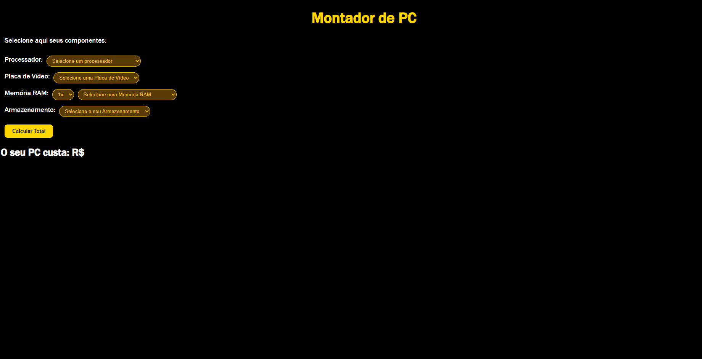

# 💻 Montador de PC Web

Um site interativo desenvolvido para auxiliar usuários a simular o orçamento e a montagem de um computador. O usuário seleciona os componentes desejados e o sistema calcula automaticamente o valor total da configuração.

---

## 🚀 Funcionalidades

- **Seleção de Componentes:** Processadores, Placas de Vídeo, Memória RAM e Armazenamento.
- **Cálculo Automático:** Soma os valores dos itens selecionados dinamicamente.
- **Validação Visual:** Destaque em bordas coloridas nos seletores para indicar preenchimento.

---

## 🛠️ Tecnologias Utilizadas

- **HTML5:** Estruturação semântica do projeto.
- **CSS3:** Estilização com tema escuro e detalhes em dourado.
- **JavaScript (ES6):** Manipulação de DOM, regras de negócio e cálculo dos totais.

---

## 📸 Demonstração



---

## 🔧 Como Executar o Projeto

1. Clone este repositório:
   ```bash
   git clone [https://github.com/JoaoPedroRDev/Montagem-de-PC.git](https://github.com/JoaoPedroRDev/Montagem-de-PC.git)
